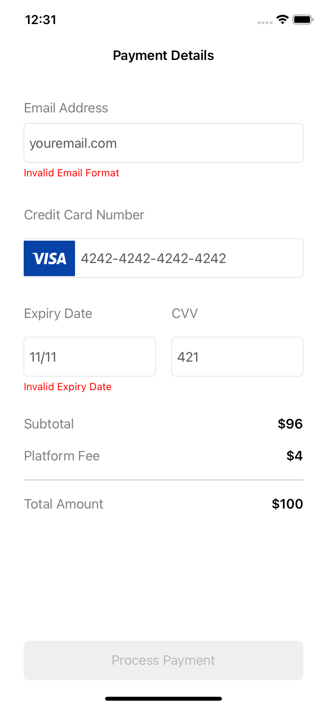
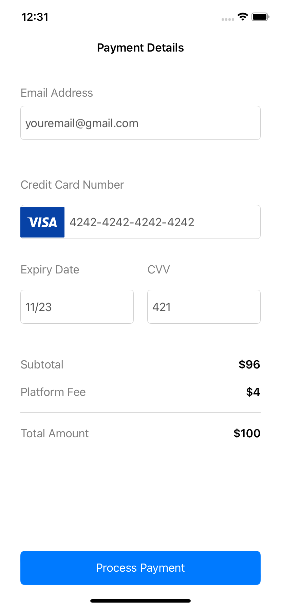
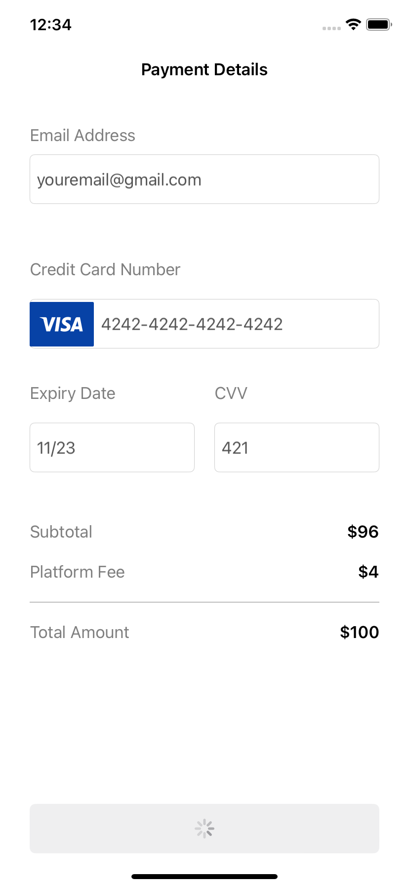

# Payment-App

## About The Project

    

This is a single-view app, which simulates simple checkout scene. App is built using MVVM structural design and Swift programming language without third party libraries. I'm using Combine publishers to update View from viewModel and simple error handling for vlaidating email and expiry date of the credit card. View is built programatically, without Storyboards. 
